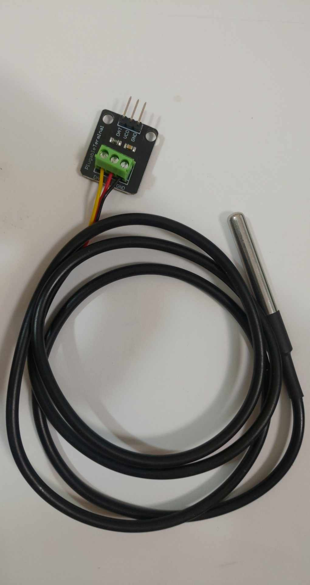

# DS18B20 溫度感測器



## 簡介

DS18B20 是一款數位溫度感測器，由 Maxim Integrated 公司生產。它使用 1-Wire 通訊協定，可以通過單一數據線進行通訊。

## 主要特點

- 測量範圍：-55°C 到 +125°C
- 精度：±0.5°C（-10°C 到 +85°C 範圍內）
- 數位輸出，無需額外的 ADC 轉換
- 每個感測器都有唯一的 64 位元序列號
- 可程式化解析度：9 到 12 位元
- 工作電壓：3.0V 到 5.5V

## 接線方式

DS18B20 通常有三個引腳：
1. GND：接地
2. DQ：數據線
3. VDD：電源（3.0V 到 5.5V）

## 樹莓派 5 設定步驟

### 1. 硬體連接
- 將 DS18B20 的 GND 連接到樹莓派的 GND
- 將 DS18B20 的 VDD 連接到樹莓派的 3.3V
- 將 DS18B20 的 DQ 連接到樹莓派的 GPIO4（或其他 GPIO 引腳）
- 在 DQ 和 3.3V 之間連接一個 4.7kΩ 的上拉電阻

### 2. 系統設定
1. 開啟終端機，編輯設定檔：
   ```bash
   sudo nano /boot/config.txt
   ```

2. 在檔案末尾添加以下行：
   ```
   dtoverlay=w1-gpio,gpio=4
   ```

3. 重新啟動樹莓派：
   ```bash
   sudo reboot
   ```

### 3. 測試感測器
1. 重新啟動後，檢查感測器是否被識別：
   ```bash
   ls /sys/bus/w1/devices/
   ```
   您應該會看到類似 `28-xxxxxxxxxxxx` 的目錄名稱

2. 讀取溫度數據：
   ```bash
   cat /sys/bus/w1/devices/28-xxxxxxxxxxxx/w1_slave
   ```
   輸出中的 `t=` 後面的數字就是溫度值（需要除以 1000 得到攝氏溫度）

## 應用場景

- 環境監控
- 工業控制
- 溫度測量系統
- 物聯網（IoT）應用
- 智能家居系統

## 注意事項

- 使用時需要接上拉電阻（通常為 4.7kΩ）
- 在長距離傳輸時需要注意信號衰減
- 多個感測器可以並聯在同一條數據線上
- 確保樹莓派和 DS18B20 的電源供應穩定
- 如果使用多個感測器，每個感測器都需要唯一的序列號 