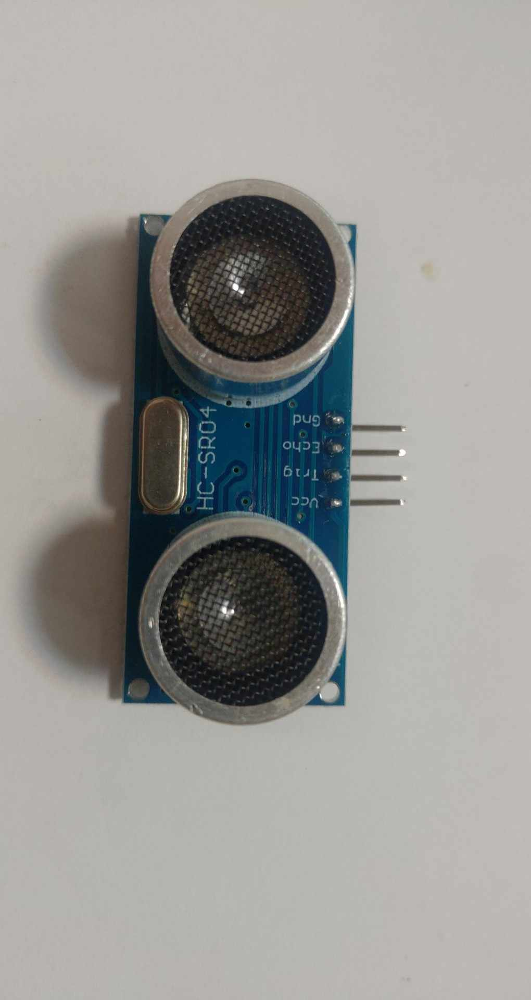

# HC-SR04 超音波距離感測器

這是一個用於控制 HC-SR04 超音波距離感測器的 Python 程式庫。該程式庫提供了簡單的介面來測量物體與感測器之間的距離。



## 功能特點

- 簡單易用的 Python 介面
- 支援單次和多次測量
- 自動計算平均值以提高準確性
- 完整的錯誤處理和日誌記錄
- 支援 GPIO 腳位自定義配置

## 硬體需求

- Raspberry Pi（任何型號）
- HC-SR04 超音波感測器
- 連接線（建議使用杜邦線）

## 接線說明


| HC-SR04 腳位 | Raspberry Pi 腳位 |
|-------------|------------------|
| VCC         | 5V               |
| Trig        | GPIO 23          |
| Echo        | GPIO 24          |
| GND         | GND              |

## 安裝依賴

```bash
pip install gpiozero
```

## 使用範例

```python
from hcsr04 import HCSR04

# 創建感測器實例
sensor = HCSR04()

try:
    # 測量單次距離
    distance = sensor.get_distance()
    print(f"距離：{distance:.2f} 公分")

    # 測量多次並計算平均值
    avg_distance = sensor.get_average_distance(samples=5, delay=0.1)
    print(f"平均距離：{avg_distance:.2f} 公分")

finally:
    # 確保關閉感測器
    sensor.close()
```

## 參數說明

### 初始化參數
- `trigger_pin` (int): Trigger 腳位的 BCM 編號，預設為 23
- `echo_pin` (int): Echo 腳位的 BCM 編號，預設為 24

### 測量參數
- `samples` (int): 測量次數，預設為 3
- `delay` (float): 每次測量之間的延遲時間（秒），預設為 0.1

## 注意事項

1. 確保使用正確的 GPIO 腳位編號（BCM 編號）
2. 測量範圍通常在 2-400 公分之間
3. 超出範圍的測量可能不準確
4. 建議使用奇數次測量來計算平均值
5. 程式結束前務必調用 `close()` 方法

## 特別注意事項

### 硬體連接
1. **電源連接**
   - 確保 VCC 腳位連接正確的電壓（5V）
   - 避免電源反接，可能損壞感測器
   - 建議使用穩定的電源供應

2. **信號線連接**
   - Trigger 和 Echo 腳位必須正確連接到 GPIO
   - 建議使用較短的連接線，減少信號干擾
   - 避免信號線與電源線平行走線

3. **環境因素**
   - 避免在高溫或潮濕環境使用
   - 保持感測器表面清潔，避免灰塵或水氣影響
   - 避免強光直射感測器

### 測量注意事項
1. **測量範圍**
   - 最小測量距離約 2 公分
   - 最大測量距離約 400 公分
   - 超出範圍的測量結果不可靠

2. **測量精度**
   - 測量精度約 ±3mm
   - 建議使用多次測量取平均值
   - 測量間隔建議至少 0.1 秒

3. **測量對象**
   - 測量表面應盡量平整
   - 避免測量吸音材料
   - 避免測量移動中的物體


## 錯誤處理

程式庫內建完整的錯誤處理機制，會記錄以下情況：
- 感測器初始化失敗
- 距離測量失敗
- 平均距離計算失敗
- 感測器關閉失敗

