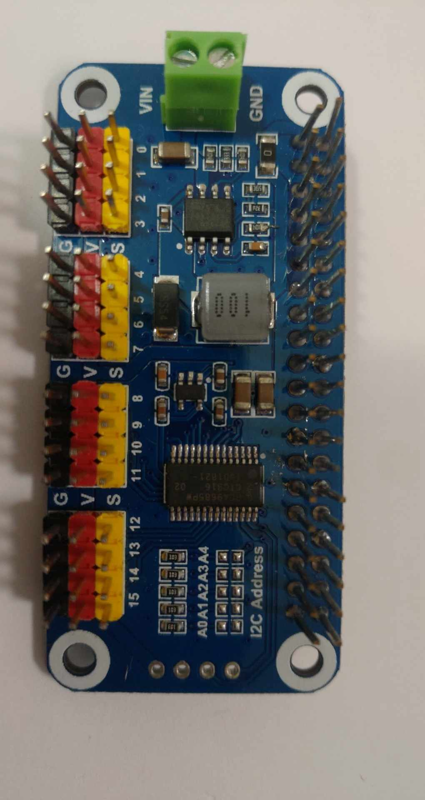
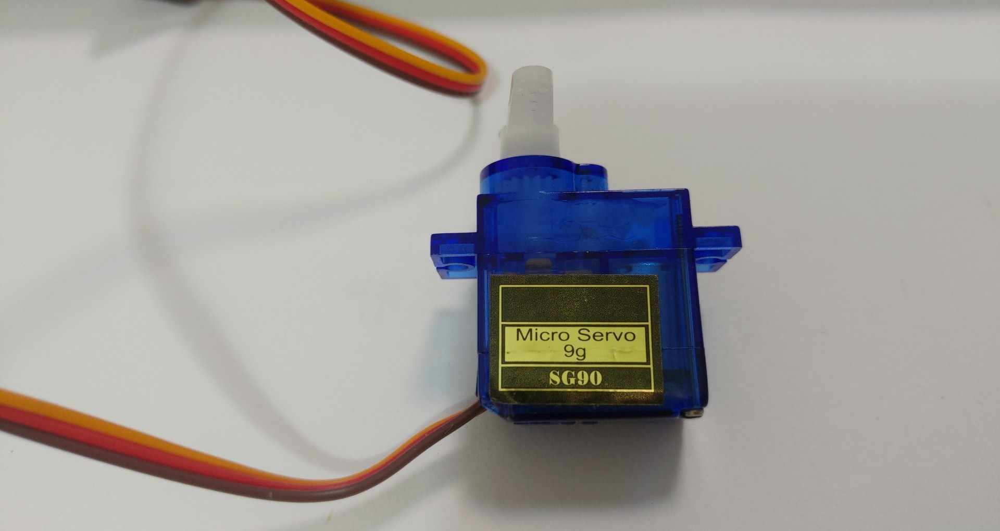

# PCA9685 模組說明

## Raspberry Pi 5 設定

### 1. 啟用 I2C 介面

在 Raspberry Pi 5 上，需要先啟用 I2C 介面：

```bash
# 使用 raspi-config 工具
sudo raspi-config
# 選擇 "Interface Options" -> "I2C" -> "Yes"
```

或直接編輯 `/boot/config.txt`：

```bash
sudo nano /boot/config.txt
# 添加或取消註釋以下行：
dtparam=i2c_arm=on
```

### 2. 安裝必要套件

```bash
# 更新套件列表
sudo apt update

# 安裝 Python 開發工具
sudo apt install python3-dev python3-pip

# 安裝 I2C 工具
sudo apt install i2c-tools

# 安裝 Python 依賴套件
pip3 install adafruit-circuitpython-pca9685
```

### 3. 檢查 I2C 設備

```bash
# 檢查 I2C 設備是否被識別
sudo i2cdetect -y 1
```

如果 PCA9685 正確連接，應該會看到地址 `0x40`（或其他設定的地址）。

### 4. 權限設定

確保使用者有權限訪問 I2C 設備：

```bash
# 將使用者加入 i2c 群組
sudo usermod -aG i2c $USER

# 重新登入或執行以下命令使更改生效
newgrp i2c
```

### 5. 測試連接

使用以下命令測試 I2C 連接：

```bash
# 檢查 I2C 設備
sudo i2cdetect -y 1

# 檢查 I2C 模組是否載入
lsmod | grep i2c
```

## PCA9685 模組介紹



PCA9685 是一個 16 通道的 PWM (脈衝寬度調變) 控制器，具有以下特點：

- 16 個獨立的 PWM 輸出通道
- 使用 I2C 通訊介面
- 可控制 LED 亮度或伺服馬達
- 工作電壓：2.3V - 5.5V
- 可編程 PWM 頻率：24Hz - 1526Hz
- 12 位元解析度（4096 級）

### 主要應用
- LED 燈光控制
- 伺服馬達控制
- 需要精確 PWM 控制的應用

### 接線說明
| PCA9685 腳位 | 連接說明 |
|-------------|----------|
| VCC         | 電源正極 (2.3V - 5.5V) |
| GND         | 電源負極 |
| SCL         | I2C 時鐘線 |
| SDA         | I2C 數據線 |
| OE          | 輸出使能（低電平有效） |
| PWM0-PWM15  | PWM 輸出通道 |

# PCA9685 SG90 伺服馬達控制說明

## SG90 伺服馬達介紹



SG90 是一種小型伺服馬達，具有以下特點：
- 工作電壓：4.8V-6V
- 扭力：1.8kg/cm
- 重量輕，體積小
- 常用於機器人、遙控模型等專案

## 1. 連接圖

| SG90 線色   | PCA9685 腳位 | 說明         |
|-------------|-------------|--------------|
| 棕色 (GND)  | GND         | 接地         |
| 紅色 (VCC)  | V+ (5V)     | 電源 5V      |
| 橘色 (PWM)  | CH0~CH15    | PWM訊號輸出  |

> **注意：** V+ 必須為 5V，否則伺服馬達無法正常運作。

---

## 2. PWM 控制原理

- **PWM 頻率**：50Hz（週期 20ms）
- **脈衝寬度**：
  - 1.0ms（1000us）：最左（0度）
  - 1.5ms（1500us）：中間（45度）
  - 2.0ms（2000us）：最右（90度）
- **duty_cycle 計算**（Adafruit PCA9685，16位元）：
  ```
  duty_cycle = (脈衝寬度 / 20000) * 65535
  ```

---

## 3. Python 控制範例

```python
import time
from board import SCL, SDA
import busio
from adafruit_pca9685 import PCA9685

class SG90:
    def __init__(self, channel=0, frequency=50):
        self.i2c = busio.I2C(SCL, SDA)
        self.pca = PCA9685(self.i2c)
        self.pca.frequency = frequency
        self.servo_channel = self.pca.channels[channel]

    def set_angle(self, angle):
        if angle < 0 or angle > 90:
            raise ValueError("角度必須在 0 到 90 度之間")
        min_us = 1000
        max_us = 2000
        pulse_us = min_us + (angle / 90.0) * (max_us - min_us)
        duty_cycle = int((pulse_us / 20000.0) * 65535)
        self.servo_channel.duty_cycle = duty_cycle
        print(f"設定角度: {angle}度, 脈衝寬度: {pulse_us:.1f}us, duty_cycle: {duty_cycle}")

    def cleanup(self):
        self.pca.deinit()
        self.i2c.deinit()

if __name__ == "__main__":
    servo = SG90()
    try:
        angle = 0
        while angle <= 90:
            servo.set_angle(angle)
            time.sleep(1)
            angle += 5
    finally:
        servo.cleanup()
```

---

## 4. 常見問題

- **Q：為什麼 1000us~2000us 只動 90 度？**  
  A：SG90 實際可動範圍常小於標稱 180 度，1000~2000us 通常只對應 90 度，屬正常現象。

- **Q：可以用更大脈衝寬度嗎？**  
  A：可嘗試 500us~2500us，但有損壞風險，請小心測試。

---

## 5. 參考資料

- [Adafruit PCA9685 Servo Driver Library](https://github.com/adafruit/Adafruit_CircuitPython_PCA9685)
- [SG90 伺服馬達規格書](https://www.electronicoscaldas.com/datasheet/SG90.pdf) 